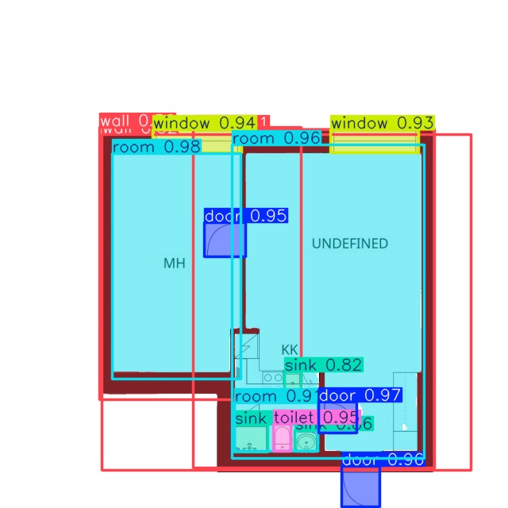
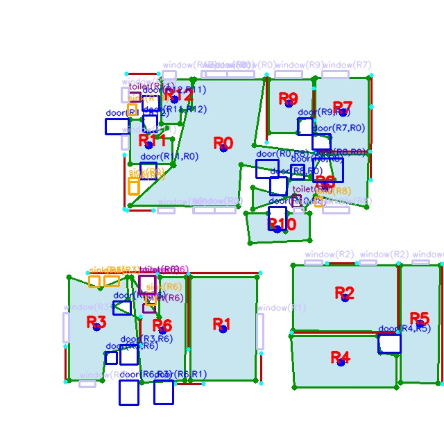
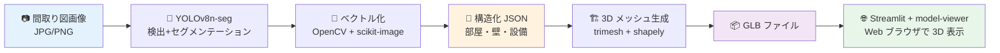
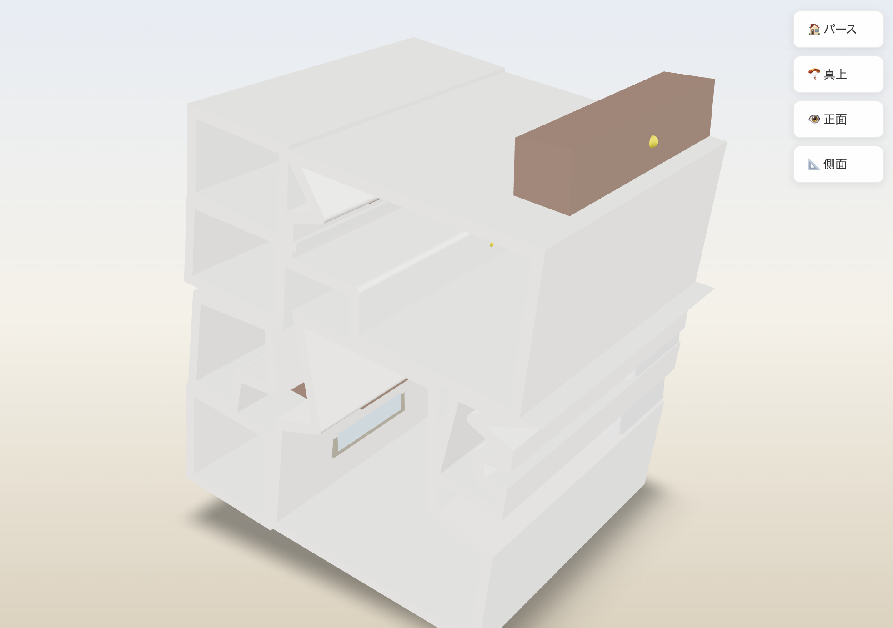

# 🏠 Floor Plan Recognition: 間取り図 → 3D の家

> 1枚の間取り図 (PNG/JPG) を入力すると、**部屋・壁・設備を自動認識**し、
> ブラウザで回転できる **3D の家** として可視化するシステム。

<p align="center">
  
  <br/>
  <em>YOLOv8n-seg による検出+セグメンテーション結果 (mAP@0.5 = 0.903)</em>
</p>

[](https://opensource.org/licenses/MIT)


---

## ✨ TL;DR

- **ML パイプライン**(YOLOv8n-seg)で 8 クラスを物体検出+セグメンテーション
- 推論結果を **OpenCV + scikit-image でベクトル化**(部屋ポリゴン、壁線分、設備配置)
- **trimesh + shapely で 3D メッシュ生成**(床、壁、家具)→ GLB 形式出力
- **Streamlit + Google `<model-viewer>`** でブラウザ上で 3D 表示
- 全工程が完全自動・**1.5〜4 秒** で完了

---

## 📊 主要成果

| 指標 | 値 |
|---|---|
| 物体検出 mAP@0.5 (test set) | **0.966** |
| セグメンテーション Mask mAP@0.5 | **0.903** |
| - room (部屋) Mask AP | **0.987** ⭐ |
| - wall (壁) Mask AP | 0.683 |
| エンドツーエンド処理時間 (M2 MacBook Air) | 1.5〜4 秒 |
| 推論時間 (MPS, warmup 後) | 150〜500 ms/枚 |
| GLB ファイルサイズ | 30〜65 KB |

**4 実験で物体検出の mAP@0.5 を 0.815 → 0.966 (+15.1pt) に改善**。
詳細は [§ 実験ログ](#-実験ログ4-実験の物語) を参照。

<p align="center">
  
  <br/>
  <em>マスクをベクトル化:部屋ポリゴン (緑) + 壁線分 (赤) + 設備配置を構造化 JSON に</em>
</p>

---

## 🏗️ アーキテクチャ



### 各ステージの内訳

| Stage | 何をするか | 主要技術 | 出力 |
|---|---|---|---|
| 1. 検出+セグ | 8 クラス(door, room, shower, sink, staircase, toilet, wall, window)を推論 | Ultralytics YOLOv8 | マスク + bbox |
| 2. ベクトル化 | マスクをポリゴン・線分・bbox に変換、部屋への所属判定 | OpenCV findContours, scikit-image skeletonize, HoughLinesP | 構造化 JSON |
| 3. 3D 生成 | 部屋ポリゴンを押し出し、設備を箱で配置 | trimesh.creation.extrude_polygon, shapely.geometry.Polygon | GLB バイナリ |
| 4. Web 表示 | ブラウザに 3D ビューア + UI を表示 | Streamlit, Google <model-viewer> | インタラクティブ Web アプリ |

<p align="center">
  
  <br/>
  <em>Streamlit + Google &lt;model-viewer&gt; によるブラウザ上の 3D 表示</em>
</p>

---

## 🛠️ 技術スタック

### ML / Inference
- **Ultralytics YOLOv8** (v8.x): 物体検出 + セグメンテーション
- **PyTorch** (CPU/MPS): 推論バックエンド(Apple Silicon の MPS で高速化)
- **OpenCV** + **scikit-image**: 画像処理、輪郭抽出、スケルトン化

### 3D 生成
- **trimesh**: メッシュ操作 (extrude_polygon, Scene, GLB export)
- **shapely**: 2D ポリゴン操作 (validity check, make_valid)
- **mapbox-earcut** + **manifold3d**: 三角分割エンジン

### Web UI
- **Streamlit**: Web アプリフレームワーク
- **Google `<model-viewer>`**: GLB ファイルの表示(Web Component)

### 開発環境
- Python 3.11, conda env `floorplan`
- MacBook Air M2 (8GB, MPS) / Google Colab T4 GPU (学習時)
- Roboflow Universe (データセット)

---

## 🚀 セットアップと実行

### 必要要件
- Python 3.11
- conda (or venv)
- macOS / Linux

### インストール
```bash
git clone git@github.com:Mao925/floor-plan-recognition.git
cd floor-plan-recognition

# Conda 環境作成
conda create -n floorplan python=3.11 -y
conda activate floorplan

# 依存ライブラリのインストール
pip install -r requirements.txt
```

### モデル
- `models/m1_seg_yolov8n/weights/best.pt` がリポジトリに含まれます (6.9MB)
- これが本プロジェクトの **メイン推論モデル**(セグメンテーション、Mask mAP 0.903)

### Web アプリを起動
```bash
streamlit run src/app.py
```

ブラウザが自動で `http://localhost:8501` を開きます。

1. **「📁 ファイルをアップロード」** or **「🖼️ サンプル画像」** を選択
2. **「🚀 3D を生成」** ボタン
3. 約 1.5〜4 秒で 3D の家が表示される(回転・ズーム・パン可能)

### コマンドライン実行(個別)
```bash
# 推論結果から JSON を生成
python scripts/build_floorplan_json.py

# JSON から GLB を生成
python scripts/build_3d_model.py
```

---

## 🧪 実験ログ(4 実験の物語)

物体検出モデル (YOLOv8n) を 4 つの設定で学習し、test セットで評価。

| 実験 | モデル | imgsz | epochs | mAP@0.5 | 学習時間 | コメント |
|---|---|---|---|---|---|---|
| Baseline | YOLOv8n | 640 | 50 | 0.815 | 4 分 | 出発点 |
| Exp 1 | YOLOv8n | **1024** | 50 | 0.903 | 8 分 | 解像度を 640→1024 に上げて +8.8pt |
| **Exp 2** ⭐ | YOLOv8n | 1024 | **100** | **0.966** | 15 分 | epochs を倍に。**最良** |
| Exp 3 | **YOLO26n** | 1024 | 100 | 0.867 | 17 分 | **最新モデルが必ずしも良いとは限らない** ❌ |

### 各実験の意図と結果

**Baseline (mAP 0.815)**: まずは小さい解像度で「動く状態」を作って数値の基準線を取る。

**Exp 1 (0.903)**: 仮説「間取り図の設備は小さい記号なので、高解像度推論が効くはず」。
→ +8.8pt の改善で **仮説が裏付けられた**。

**Exp 2 (0.966)**: 仮説「epochs を倍にすれば、未収束な部分が伸びるはず」。
→ +6.3pt の改善で **再度仮説支持**。特に shower クラスは 0.42 → 0.93 と劇的改善。

**Exp 3 (0.867)**: 仮説「2025 年公開の最新モデル YOLO26n は YOLOv8n より良いはず」。
→ **逆に -9.9pt の悪化で反証**。COCO ベンチマークで優れていても、特定ドメイン(間取り図)では学習曲線が異なる。
**「最新 = 良い」は思い込みであることを実証**。

### マルチタスク学習による副次的改善

セグメンテーション学習 (M1) では、検出単体ではなく **8 クラス同時のマルチタスク学習** を行った。
結果、shower クラスの **検出単体スコア 0.93 が、マルチタスク学習で 0.95 に向上**。
これは「関連タスクを同時に学ぶことで表現学習が深まる」という仮説の現れ。

---

## 💡 設計判断と学び

このプロジェクトで明示的に行った6つの主要な技術判断。

### 1. データセット選定: Roboflow Universe の「Floor Plan Annotation v1」を採用

- **検討した代替案**: CubiCasa5K (5,000 枚、高品質だが研究用ライセンス)、自作アノテーション (人的コスト高)
- **採用理由**: CC BY 4.0 で商用利用可、227 枚で十分な多様性、Roboflow API でダウンロード自動化
- **トレードオフ**: データ量が少ない (227 枚) ため、データ拡張と学習設定の工夫が必要

### 2. クラス選定: 8 クラスから bathtub を除外

- 元データセットは 9 クラスだったが、**bathtub のラベル数が他の 1/10 以下** で学習不安定
- 除外せず学習すると mAP に悪影響、`door`, `shower`, `sink`, `staircase`, `toilet`, `window` を主要設備とし、`room`, `wall` を構造として扱う
- **データ駆動の意思決定**:統計を見て削除を判断

### 3. 「最新モデル ≠ 最良」の実証 (Exp 3)

- YOLO26n (2025年公開) を試したが、**COCO ベンチマークでの優位性は本データに転移しなかった**
- 新規モデルは事前学習データやアーキテクチャの最適化が COCO 寄りで、ドメイン特化タスクで劣化することがある
- 結論:**論文や benchmark の数字を鵜呑みにせず、実データで検証する姿勢が重要**

### 4. ベクトル化のヒューリスティック(クラス固有の部屋紐付け)

- 推論結果(マスク)から **構造化 JSON** に変換する後処理層を実装
- 当初は「設備の中心点が部屋ポリゴン内か」で判定 → **92% が「部屋外」** (door/window は壁の上にあるため)
- **クラス固有のロジック** に変更:
  - `door, window`: 壁の上 → **最も近い 2 部屋** に紐付け
  - `toilet, sink, shower, staircase`: 部屋の中 → **最も近い 1 部屋** に紐付け
- 結果:未紐付け率 **92% → 0%** に。**建築物のセマンティクスをコードに落とし込んだ例**

### 5. 3D ビューア:自前 Three.js から Google `<model-viewer>` への乗り換え

- Phase 6 で自前 Three.js を実装したが、**商用レベルの見た目に到達するには工数が膨大**(数十時間以上)
- 業界標準の Web Component `<model-viewer>` (Google 製) に切り替え
- **コード量約 60% 削減、見た目はプロ品質**(PBR レンダリング、環境光、影が標準装備)
- **「自前実装 vs 枯れたライブラリ」の判断**:学習目的なら自前、成果物なら標準ライブラリ

### 6. f-string と JavaScript の中括弧衝突問題

- Streamlit `components.html()` で Three.js を埋め込む際、Python の f-string `{}` と JS の `{}` がぶつかり、`{{...}}` のエスケープが多重化して構文エラー
- **`str.replace()` + プレースホルダ方式** に変更し解決
- 「言語境界の落とし穴」として記録:**異なる言語のテンプレートを混ぜる時は、エスケープ不要な置換方式が安全**

---

## 📂 ディレクトリ構成

```
floor-plan-recognition/
├── notebooks/                            # Google Colab 学習用
│   ├── 01_baseline_training.ipynb
│   ├── 02_exp1_highres_training.ipynb
│   ├── 03_exp2_long_training.ipynb       # 最終採用 (検出, mAP 0.966)
│   ├── 04_exp3_yolo26n_training.ipynb
│   └── 05_m1_seg_training.ipynb          # 最終採用 (セグ, Mask mAP 0.903)
├── scripts/
│   ├── check_env.py                       # 環境確認
│   ├── download_roboflow.py               # データダウンロード
│   ├── prepare_dataset.py                 # 検出用 6 クラスデータ準備
│   ├── prepare_dataset_seg.py             # セグ用 8 クラスデータ準備
│   ├── test_inference.py                  # 検出テスト
│   ├── test_seg_inference.py              # セグテスト
│   ├── build_floorplan_json.py            # M1 推論 → ベクトル化 → JSON
│   └── build_3d_model.py                  # JSON → 3D GLB
├── src/
│   ├── inference.py                       # 検出推論モジュール
│   ├── vectorize.py                       # ベクトル化 (部屋・壁・設備紐付け)
│   ├── pipeline.py                        # フルパイプライン統合関数
│   └── app.py                             # Streamlit Web アプリ
├── models/
│   ├── exp2_long_yolov8n/                 # 検出ベスト (mAP 0.966)
│   └── m1_seg_yolov8n/                    # セグメンテーション (Mask mAP 0.903)
├── outputs/                               # .gitignore で除外
│   ├── floorplan_json/                    # ベクトル化結果
│   └── 3d_models/                         # 生成された GLB
├── data/                                  # .gitignore で除外
├── README.md
├── requirements.txt
└── .gitignore
```

---

## 📜 ライセンス & 謝辞

- このコードベース: **MIT License**
- データセット: [Floor Plan Annotation v1](https://universe.roboflow.com/smartapp-3jazx/floor-plan-annotation-u6whl/dataset/1) (CC BY 4.0) by smartapp on Roboflow Universe
- 学習基盤: [Ultralytics YOLOv8](https://github.com/ultralytics/ultralytics) (AGPL-3.0)
- 3D ビューア: [Google `<model-viewer>`](https://modelviewer.dev/) (Apache 2.0)

---

## 🔗 関連リンク

- **GitHub**: [Mao925/floor-plan-recognition](https://github.com/Mao925/floor-plan-recognition)
- **データセット元**: [Roboflow Universe](https://universe.roboflow.com/smartapp-3jazx/floor-plan-annotation-u6whl/dataset/1)

---

*Built with ❤️ as a portfolio project demonstrating end-to-end ML engineering: from data curation to deployable web demo.*
